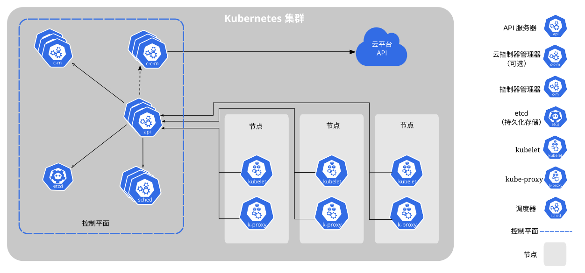

## Kubernetes

Kubernetes 是一个开源的容器编排引擎，用来对容器化应用进行自动化部署、扩缩和管理。此开源项目由[云原生计算基金会（CNCF）](https://www.cncf.io/about)托管。

### 一、minikube学习环境

通过minikube进行本地部署，示例使用Ubuntu26.04

#### 1.配置前准备：

官方要求的配置和预安装环境如下：

- 2 CPUs or more
- 2GB of free memory
- 20GB of free disk space
- Internet connection
- Container or virtual machine manager, such as: [Docker](https://minikube.sigs.k8s.io/docs/drivers/docker/), [QEMU](https://minikube.sigs.k8s.io/docs/drivers/qemu/), [Hyperkit](https://minikube.sigs.k8s.io/docs/drivers/hyperkit/), [Hyper-V](https://minikube.sigs.k8s.io/docs/drivers/hyperv/), [KVM](https://minikube.sigs.k8s.io/docs/drivers/kvm2/), [Parallels](https://minikube.sigs.k8s.io/docs/drivers/parallels/), [Podman](https://minikube.sigs.k8s.io/docs/drivers/podman/), [VirtualBox](https://minikube.sigs.k8s.io/docs/drivers/virtualbox/), or [VMware Fusion/Workstation](https://minikube.sigs.k8s.io/docs/drivers/vmware/)

#### 2.安装minikube

* Linux：x86-64

  * Binary download

    ```bash
    curl -LO https://github.com/kubernetes/minikube/releases/latest/download/minikube-linux-amd64
    sudo install minikube-linux-amd64 /usr/local/bin/minikube && rm minikube-linux-amd64
    ```

  * Debian package

    ```bash
    curl -LO https://storage.googleapis.com/minikube/releases/latest/minikube_latest_amd64.deb
    sudo dpkg -i minikube_latest_amd64.deb
    ```

  * RPM package

    ```bash
    curl -LO https://storage.googleapis.com/minikube/releases/latest/minikube-latest.x86_64.rpm
    sudo rpm -Uvh minikube-latest.x86_64.rpm
    ```

* 其他系统参阅官网

#### 3.启动集群

```bash
minikube start
```

> 注意（国内环境建议使用下述方案）：国内网络环境一般不支持，建议开启代理。
>
> 1. 如果是虚拟机，则需先确保能访问宿主机的代理，可使用`telnet ip port`指令测试（失败则查看宿主机防火墙、代理软件是否已开启局域网链接等）
>
> 2. Docker创建配置目录
>
>    ```bash
>    sudo mkdir -p /etc/systemd/system/docker.service.d
>    ```
>
> 3. 写 proxy 配置
>
>    ```bash
>    sudo tee /etc/systemd/system/docker.service.d/http-proxy.conf <<EOF
>    [Service]
>    Environment="HTTP_PROXY=http://宿主机IP:代理端口"
>    Environment="HTTPS_PROXY=http://宿主机IP:代理端口"
>    Environment="NO_PROXY=localhost,127.0.0.1,::1,192.168.0.0/16,10.0.0.0/8,172.16.0.0/12,.local"
>    EOF
>    ```
>
> 4. 重启Docker
>
>    ```bash
>    sudo systemctl daemon-reexec
>    sudo systemctl restart docker
>    ```
>
> 5. 查看Docker代理是否成功配置
>
>    ```bash
>    docker info | grep -i proxy
>    ```
>
> 6. 测试拉取镜像是否成功
>
>    ```bash
>    docker pull hello-world
>    ```
>
> 7. 重启minikube（安装镜像缓存路径`/home/master/.minikube/cache/`，可以通过删除缓存彻底重装）
>
>    ```bash
>    minikube delete
>                                                                                                                      
>    minikube start \
>      --driver=docker \
>      --docker-env HTTP_PROXY=http://宿主机IP:代理端口 \
>      --docker-env HTTPS_PROXY=http://宿主机IP:代理端口 \
>      --docker-env NO_PROXY=localhost,127.0.0.1,::1,192.168.0.0/16,10.0.0.0/8,172.16.0.0/12,.local
>    ```
>
>    > 如果还是提示镜像拉取失败，则可以手动在docker拉取镜像代替，比如示例中会遇到`Pulling base image v0.0.50`失败，则通过`docker pull gcr.io/k8s-minikube/kicbase:v0.0.50`拉取镜像，然后在`minikube start`指令中加入参数`--base-image=gcr.io/k8s-minikube/kicbase:v0.0.50`

#### 4.与集群交互

* 查看你的集群

  ```bash
  minikube kubectl -- get po -A
  ```

  > 若已安装kubectl，也可以直接使用`kubectl get po -A`
  >
  > 也可以通过简化指令：`alias kubectl="minikube kubectl --"`

* 仪表盘（minikube集成了k8s仪表盘）

  ```bash
  minikube dashboard
  ```
  
  执行完会提示仪表盘的访问地址，只限于本地访问，要是在虚拟机中或者需要外部访问，需要添加外部访问代理：
  
  ```bash
  kubectl proxy --port=8000 --address='虚拟机ip' --accept-hosts='^.*' &
  ```

#### 5.部署示例应用

* 部署一个Deployment

  ```bash
  kubectl create deployment hello-minikube --image=kicbase/echo-server:1.0
  ```

* 部署后通过指令查看

  ```bash
  kubectl get deployments
  ```

  输出：

  ```bash
  NAME             READY   UP-TO-DATE   AVAILABLE   AGE
  hello-minikube   1/1     1            1           55s
  ```

* 查看Pods

  ```bash
  kubectl get pods
  ```

  输出：

  ```bash
  NAME                              READY   STATUS    RESTARTS   AGE
  hello-minikube-58f7c595dd-f7544   1/1     Running   0          21s
  ```

* 查看集群事件

  ```bash
  kubectl get events
  ```

* 查看`kubectl`配置

  ```bash
  kubectl config view
  ```

* 查看Pod中容器的应用程序日志（使用Pod名称）

  ```bash
  kubectl logs <hello-minikube-58f7c595dd-f7544>
  ```

* 创建Service，使用端口`8080`（测试镜像监听的是TCP`8080`端口）

  ```bash
  kubectl expose deployment hello-minikube --type=NodePort --port=8080
  ```

* 查看Service

  ```bash
  kubectl get services
  ```

  输出：

  ```bash
  NAME             TYPE        CLUSTER-IP     EXTERNAL-IP   PORT(S)          AGE
  hello-minikube   NodePort    10.111.55.94   <none>        8080:30761/TCP   29s
  kubernetes       ClusterIP   10.96.0.1      <none>        443/TCP          4m55s
  ```

  > 对于支持负载均衡器的云服务平台而言，平台将提供一个外部 IP 来访问该 Service。在Minikube上，`LoadBalancer`使得Service可以通过命令`minikube service`访问

* 查看执行服务的url访问地址信息

  ```bash
  minikube service hello-minikube
  ```

  输出：

  ```bash
  ┌───────────┬────────────────┬─────────────┬───────────────────────────┐
  │ NAMESPACE │      NAME      │ TARGET PORT │            URL            │
  ├───────────┼────────────────┼─────────────┼───────────────────────────┤
  │ default   │ hello-minikube │ 8080        │ http://192.168.49.2:30761 │
  └───────────┴────────────────┴─────────────┴───────────────────────────┘
  * Opening service default/hello-minikube in default browser...
    http://192.168.49.2:30761
  ```

* 对服务进行端口转发

  ```bash
  kubectl port-forward service/hello-minikube 7080:8080
  ```

#### 6.管理集群

* 暂停Kubernetes（不影响当前已部署应用）

  ```bash
  minikube pause
  ```

* 解除暂停Kubernetes

  ```bash
  minikube unpause
  ```

* 停止集群

  ```bash
  minikube stop
  ```

* 更改默认内存限制（需要重启）

  ```bash
  minikube config set memory 9001
  ```

* 列出集群中所有可用的插件

  ```bash
  minikube addons list
  ```

* 创建另一个新集群（可以指定版本）

  ```bash
  minikube start -p aged --kubernetes-version=v1.34.0
  ```

* 删除所有集群

  ```bash
  minikube delete --all
  ```

* 升级集群

  ```bash
  minikube start --kubernetes-version=latest

#### 7.插件

minikube内置的一些可以快速部署的应用和服务

* 列出集群中所有可用的插件

  ```bash
  minikube addons list
  ```

* 启用指定插件

  ```bash
  minikube addons enable <name>
  ```

* 启动时则加载并启用插件（支持指定多个）

  ```bash
  minikube start --addons <name1> --addons <name2>
  ```

* 暴露需要开启端口的插件

  ```bash
  minikube addons open <name>
  ```

* 禁用插件

  ```bash
  minikube addons disable <name>
  ```


#### 8.Kubectl

默认情况下，当执行`minikube start`时，kubectl会被配置为访问minikube内部的Kubernetes集群，指令：`kubectl <kubectl commands>`。若本地没有安装kubectl，也可使用minikube自带的kubectl工具：`minikube kubectl -- <kubectl commands>`

* 获取`pods`

  ```bash
  minikube kubectl -- get pods
  ```

* 获取帮助

  ```bash
  minikube kubectl -- --help
  ```

#### 9.访问应用

在Kubernetes中有两大类服务：

* NodePort
* LoadBalancer

##### Ⅰ.NodePort

NodePort方式是提供外部访问服务的最基础方式，将服务端口映射到本地，并通过本地的IP+映射的端口访问服务的endpoint

* 获取minikube的`IP`和服务的`NodePort`

  ```bash
  minikube service <service-name> --url
  ```

* minikube服务启用tunnel

  在Darwin、Windows或WSL上使用Docker驱动时网络会受到限制，无法直接访问节点IP。在Linux上使用Docker驱动运行minikube则不会创建tunnel

  NodePort服务可以通过`minikube service <service-name> --url`命令来暴露。命令需要在单独的终端窗口中运行以保持tunnel打开。若在终端中按Ctrl+C则终止该进程，此时网络路由将被清理

* NodePort示例

  1. 创建Kubernetes deployment

     ```bash
     kubectl create deployment hello-minikube1 --image=kicbase/echo-server:1.0
     ```

  2. 将已有的deployment暴露为NodePort服务

     ```bash
     kubectl expose deployment hello-minikube1 --type=NodePort --port=8080
     ```

  3. 查看NodePort服务

     ```bash
     $ kubectl get svc
     NAME              TYPE        CLUSTER-IP      EXTERNAL-IP   PORT(S)          AGE
     hello-minikube1   NodePort    10.100.238.34   <none>        8080:31389/TCP   3s
     ```

  4. 启用服务tunnel

     ```bash
     minikube service hello-minikube1 --url
     ```

     > 命令作为一个进程运行，创建到集群的tunnel，将服务直接暴露给主机操作系统上的任何程序

  5. 通过http访问服务

     ```bash
     curl -I <IP:Port>
     ```

* 使用kubectl获取NodePort

  minikube虚拟机通过仅限主机的IP地址暴露给主机系统，可以使用`minikube ip`命令获取该 IP 地址。NodePort服务都可以通过该IP地址和NodePort进行访问

  要确定服务的NodePort，可以使用如下kubectl命令（注意在JSON输出中nodePort以小写n开头）

  ```bash
  kubectl get service <service-name> --output='jsonpath="{.spec.ports[0].nodePort}"'
  ```

* 增加NodePort范围

  默认情况下，minikube只会暴露端口30000-32767，可以使用以下方式调整范围

  ```bash
  minikube start --extra-config=apiserver.service-node-port-range=1-65535
  ```

  > 命令接受以逗号分隔的端口和端口范围列表

##### Ⅱ.LoadBalancer

LoadBalancer（负载均衡）是将服务暴露到公网的标准方法。使用该方法，每个服务都有其独立的 IP 地址。服务可以通过`minikube tunnel`指令暴露。指令需要在一个独立的终端去运行，以保持LoadBalancer的运行。

1. 在独立的终端执行，指令需要管理员权限密码执行

   ```bash
   minikube tunnel
   ```

   > `minikube tunnel`作为一个进程运行，在主机的CIDR中新增路由规则，使用集群的IP地址作为网关。tunnel 命令将服务的外部访问IP直接暴露给在主机操作系统上运行的所有程序
   
2. 创建一个Kubernetes的deployment

   ```bash
   kubectl create deployment hello-minikube2 --image=kicbase/echo-server:1.0
   ```

3. 将已有的deployment暴露为LoadBalancer服务

   ```bash
   kubectl expose deployment hello-minikube2 --type=LoadBalancer --port=8080
   ```

4. 查看外部IP

   ```bash
   $ kc get svc
   NAME              TYPE           CLUSTER-IP      EXTERNAL-IP     PORT(S)          AGE
   hello-minikube1   LoadBalancer   10.96.184.178   10.96.184.178   8080:30791/TCP   40s
   ```

   > 如果没有开启minikube tunnel，EXTERNAL-IP会显示为pending

5. 通过http访问服务

   ```bash
   curl -I <IP:Port>
   ```

   > 每个服务都有自己的独立IP

### 二、概述

#### 1.Kubernetes组件

正常运行的Kubernetes集群所需的各种组件：



##### Ⅰ.核心组件

Kubernetes 集群由控制平面和一个或多个工作节点组成，核心组件如下：

###### i.控制平面组件

用于管理集群的整体状态

* kube-apiserver

  公开Kubernetes HTTP API的核心组件服务器

* etcd

  具备一致性和高可用性的键值存储，用于所有API服务器的数据存储

* kube-scheduler

  查找尚未绑定到节点的Pod，并将每个Pod分配给合适的节点

* kube-controller-manager

  运行控制器来实现Kubernetes API行为

* cloud-controller-manager（可选）

  与底层云驱动集成

###### ii.Node组件

在每个节点上运行，维护运行的Pod并提供Kubernetes运行时环境

* kubelet

  确保 Pod 及其容器正常运行

* kube-proxy（可选）

  维护节点上的网络规则以实现 Service 的功能

* 容器运行时（Container runtime）

  负责运行容器的软件

  > 非Kubernetes的一部分，而是第三方项目或产品，比如Docker

> 集群可能需要每个节点上运行额外的软件，比如在Linux节点上运行systemd来监督本地组件

##### Ⅱ.插件

插件（Addons）则用于扩展Kubernetes的功能，重要的如下：

* DNS

  集群范围内的DNS解析

* Web界面（Dashborad）

  通过Web界面进行集群管理

* 容器资源监控

  用于收集和存储容器指标

* 集群层面日志

  用于将容器日志保存到中央日志存储

#### 2.Kubernetes对象

Kubernetes对象是持久化的实体，Kubernetes使用这些实体去表示整个集群的状态，它们描述如下信息：

- 哪些容器化应用正在运行（以及在哪些节点上运行）
- 可以被应用使用的资源
- 关于应用运行时行为的策略，比如重启策略、升级策略以及容错策略

> Kubernetes对象是一种“意向表达（Record of Intent）”。对象本质上是在描述集群的工作负载状态，对象创建后，Kubernetes系统将不断维持该对象所描述的状态， 这就是 Kubernetes集群所谓的“期望状态（Desired State）”

操作Kubernetes对象，包括创建、修改或者删除等，需要使用Kubernetes API。比如使用`kubectl`命令行接口（CLI）时，CLI会调用Kubernetes API；也可以使用客户端库来直接调用Kubernetes API

**对象规约（Spec）与状态（Status）**

Kubernetes对象一般包含两个嵌套的对象字段，负责管理对象的配置： `spec`（规约） 和 `status`（状态）

具有`spec`的对象必须在创建对象时设置其内容，描述对象所具有的特征：期望状态（Desired State）

`status`描述了对象的当前状态（Current State），它由Kubernetes系统和组件设置并更新，使其达成期望状态

> 例如：
>
> Deployment表示运行在集群中的应用，当被创建时，设置Deployment的`spec`指定要求有3个副本运行。Kubernetes系统读取Deployment的 `spec`， 并启动3个应用实例，此时`status`与`spec`相匹配。若其中有实例失败了（状态变更），Kubernetes系统会通过执行修正操作来响应 `spec` 和 `status` 间的不一致（启动一个新的实例来替换）

**描述Kubernetes对象**

创建Kubernetes对象时，必须提供对象的`spec`，用来描述该对象的期望状态，以及关于对象的一些基本信息（例如名称）。当使用Kubernetes API创建对象时（或使用`kubectl`），API请求必须在请求主体中包含 JSON 格式的信息。一般通过清单（Manifest）文件提供`spec`信息，使用YAML或JSON格式。一个包含了Deployment的必需字段和对象`spec`示例文件如下：

```yaml
apiVersion: apps/v1
kind: Deployment
metadata:
  name: nginx-deployment
spec:
  selector:
    matchLabels:
      app: nginx
  replicas: 2 # 告知 Deployment 运行 2 个与该模板匹配的 Pod
  template:
    metadata:
      labels:
        app: nginx
    spec:
      containers:
      - name: nginx
        image: nginx:1.14.2
        ports:
        - containerPort: 80
```

另一种方式是使用`kubectl`命令，将`.yaml`文件作为参数，示例：

```bash
kubectl apply -f https://k8s.io/examples/application/deployment.yaml
```

输出如下：

```bash
deployment.apps/nginx-deployment created
```

**必需字段**

创建的 Kubernetes 对象所对应的清单（Manifest）文件中，必需配置字段如下：

- `apiVersion`

  创建该对象所使用的Kubernetes API的版本

- `kind`

  创建对象的类别

- `metadata`

  对象标识数据，包括`name`字符串、`UID`和`namespace`（可选）

- `spec`

  期望的对象状态

##### Ⅰ.Kubernetes对象管理

`kubectl`命令行工具支持多种不同的方式来创建和管理Kubernetes对象

###### i.管理技巧

|    管理技术    |  作用于  | 建议的环境 | 支持的写者 | 学习难度 |
| :------------: | :------: | :--------: | :--------: | :------: |
|   指令式命令   | 活跃对象 |  开发项目  |     1+     |   最低   |
| 指令式对象配置 | 单个文件 |  生产项目  |     1      |   中等   |
| 声明式对象配置 | 文件目录 |  生产项目  |     1+     |   最高   |

> 注意：应该只使用一种技术来管理Kubernetes对象，否则它们作用在同一个对象时可能带来未知问题

###### ii.指令式命令

运行一次性任务，直接在活跃对象上操作，不提供以前配置的历史记录

**例子**

创建一个Deployment对象来运行nginx容器的实例：

```bash
kubectl create deployment nginx --image nginx
```

**权衡**

与对象配置相比的优点：

- 命令用单个动词表示
- 命令仅需一步即可对集群进行更改

与对象配置相比的缺点：

- 命令无法与变更审查流程集成
- 执行命令不会生成变更相关的追踪日志
- 除在线运行数据外，命令不提供历史记录数据源
- 命令不支持通过模板方式创建对象

###### iii.指令式对象配置

`kubectl`命令指定操作（创建、替换等），可选参数和至少一个文件名，指定的文件必须包含 对象的完整定义，使用YAML或JSON格式

> `replace`指令式命令会用新提供的`spec`替换现有的`spec`。当某些字段并不由配置文件决定时，则不适用于此方法。例如，LoadBalancer类型服务的externalIPs字段，是由集群控制器自动维护的，使用`replace`命令会导致其重置

**例子**

创建配置文件中定义的对象：

```bash
kubectl create -f nginx.yaml
```

删除两个配置文件中定义的对象：

```bash
kubectl delete -f nginx.yaml -f redis.yaml
```

覆盖更新配置定义的对象：

```bash
kubectl replace -f nginx.yaml
```

**权衡**

与指令式命令相比的优点：

- 对象配置可存储于如Git等源代码控制系统中
- 对象配置可与提交前审查变更和审计追踪等流程集成
- 对象配置提供了创建新对象的模板

与指令式命令相比的缺点：

- 对象配置需要对对象架构有基本的了解
- 对象配置需要额外的步骤来编写 YAML 文件

与声明式对象配置相比的优点：

- 指令式对象配置行为更加简单易懂
- 从 Kubernetes 1.5 版本开始，指令对象配置更加成熟

与声明式对象配置相比的缺点：

- 指令式对象配置更适合文件，而非目录
- 对象的更新必须反映在配置文件中，否则会在下一次替换时丢失

###### iv.声明式对象配置

`kubectl`根据目录中配置文件对不同的对象执行不同的操作，会自动检测每个文件的创建、更新和删除操作

> 声明式对象配置可以通过使用`patch`仅写入差异，而不是使用`replace`来替换整个对象

**例子**

处理`configs`目录中的所有对象配置文件，创建并更新活动对象。可以先使用`diff`子命令查看将要进行的更改，然后在进行应用：

```bash
kubectl diff -f configs/
kubectl apply -f configs/
```

递归处理目录：

```bash
kubectl diff -R -f configs/
kubectl apply -R -f configs/
```

**权衡**

与指令式对象配置相比的优点：

- 即使配置文件中没有活动对象原有的配置，也会被保留下来。
- 声明性对象配置支持对目录进行遍历并自动检测每个文件的操作类型（创建，修补，删除）

与指令式对象配置相比的缺点：

- 声明式对象配置难于调试并且出现异常时结果难以理解
- 使用diff产生的部分更新会创建复杂的合并和补丁操作

##### Ⅱ.对象名称和ID

每个Kubernetes对象都有一个UID来标识唯一性，也有一个名称来标识同类资源的唯一性。对象还包含标签（Label）和注解（Annotation）等属性

> 同一个命名空间中只能有一个名为`myapp-1234`的Pod，但是可以命名一个Pod和一个Deployment同为 `myapp-1234`

###### i.名称

客户端提供的字符串，引用资源URL中的对象，如`/api/v1/pods/some-name`

在同类型对象下，名称具有唯一性。当对象被移除后，才能创建另一个同名的新对象

> 说明：
>
> 当对象所代表的是一个物理实体（例如代表一台物理主机的 Node）时， 如果Node对象未被删除并重建时，则会创建一个同名的物理主机， Kubernetes会将新主机看作是旧主机，这可能会导致不一致性的问题

当在资源创建请求中提供`generateName`而不是`name`时，它将作为名称前缀，服务器会附加一个生成的后缀，但是仍有可能与现有名称冲突，从而导致HTTP409响应

以下是常见的四种资源命名约束：

1. DNS子域名

   可参阅[RFC 1123](https://tools.ietf.org/html/rfc1123)，规则如下：

   - 不能超过253个字符
   - 只能包含小写字母、数字，以及 '-' 和 '.'
   - 必须以字母开头
   - 必须以字母数字结尾

2. RFC 1123标签名

   可参阅[RFC 1123](https://tools.ietf.org/html/rfc1123)的DNS标签标准，规则如下：

   - 最多 63 个字符
   - 只能包含小写字母、数字，以及 '-'
   - 必须以字母数字开头
   - 必须以字母数字结尾

3. RFC 1035标签名

   可参阅[RFC 1035](https://tools.ietf.org/html/rfc1035)的DNS标签标准，规则如下：

   - 最多 63 个字符
   - 只能包含小写字母、数字，以及 '-'
   - 必须以字母开头
   - 必须以字母数字结尾

4. 路径分段名称

   某些资源类型要求名称能被安全地用作路径中，名称不能是`.`、`..`，也不可以包含`/`或`%`这些字符

> 说明：
>
> 当启用`RelaxedServiceNameValidation`特性时，Service对象名称可以以数字开头

下面是一个名称为`nginx-demo`的Pod的配置清单：

```yaml
apiVersion: v1
kind: Pod
metadata:
  name: nginx-demo
spec:
  containers:
  - name: nginx
    image: nginx:1.14.2
    ports:
    - containerPort: 80
```

###### ii.UID

由Kubernetes系统生成、用来唯一标识对象的字符串，Kubernetes UID是全局唯一标识符（UUID）

##### Ⅲ.标签和选择算符

###### i.标签

标签（Labels）是附加到Kubernetes对象（比如 Pod）上的键值对，属于用户自定义的标识属性。标签可以在创建时附加到对象，随后可以添加和修改。每个对象都可以定义一组键/值标签，键值是唯一的。

```json
"metadata": {
  "labels": {
    "key1" : "value1",
    "key2" : "value2"
  }
}
```

**动机**

标签使用户能够以松散耦合的方式将组织结构映射到系统对象，而无需客户端存储这些映射。

示例标签：

- `"release" : "stable"`, `"release" : "canary"`
- `"environment" : "dev"`, `"environment" : "qa"`, `"environment" : "production"`
- `"tier" : "frontend"`, `"tier" : "backend"`, `"tier" : "cache"`
- `"partition" : "customerA"`, `"partition" : "customerB"`
- `"track" : "daily"`, `"track" : "weekly"`

**语法和字符集**

标签是键值对，有效的标签键有两个段：可选的前缀和名称，用斜杠（`/`）分隔。 名称段是必需的，必须小于等于 63 个字符，以字母数字字符（`[a-z0-9A-Z]`）开头和结尾，带有破折号（`-`），下划线（`_`），点（`.`）和之间的字母数字。 前缀是可选的，必须是 DNS 子域：由点（`.`）分隔的一系列DNS标签，总共不超过253个字符，后跟斜杠（`/`）

`kubernetes.io/`和`k8s.io/`前缀是为Kubernetes核心组件保留的

有效标签值：

- 必须为 63 个字符或更少（可以为空）
- 除非标签值为空，否则必须以字母数字字符（`[a-z0-9A-Z]`）开头和结尾
- 包含破折号（`-`）、下划线（`_`）、点（`.`）和字母或数字

例如，以下是一个Pod的清单(manifest)，具有`environment: production`和`app: nginx`标签：

```yaml
apiVersion: v1
kind: Pod
metadata:
  name: label-demo
  labels:
    environment: production
    app: nginx
spec:
  containers:
  - name: nginx
    image: nginx:1.14.2
    ports:
    - containerPort: 80
```

###### ii.标签选择算符

与名称和UID不同，标签不支持唯一性

通过标签选择算符，客户端/用户可以识别一组对象。标签选择算符是Kubernetes中的核心分组原语

API目前支持两种类型的选择算符：基于等值和基于集合。在需要匹配多个时，使用逗号分隔（充当逻辑与（`&&`）运算符）

>说明：
>
>对于某些API类别（例如 ReplicaSet），两个实例的标签选择算符不得在命名空间内重叠， 否则它们的控制器将互相冲突，无法确定应该存在的副本个数

> 注意：
>
> 对于基于等值的和基于集合的条件而言，不存在逻辑或（`||`）操作符

**基于等值的需求**

基于等值或基于不等值的需求可以按标签键和值进行过滤， 匹配对象必须满足所有指定的标签约束。运算符有`=`（相等）、`==`（相等）和`!=`（不相等）三种。比如：

* `environment = production`选择键名`environment `且值等于`production`的资源；

* `tier!=frontend`选择没有`tier`键名或者键名等于`tier`且值不等于`frontend`的资源；

* 可以使用逗号来追加选择条件：`environment=production,tier!=frontend`

基于等值的标签要求，其中一个场景是Pod要指定节点选择标准，如下示例Pod选择存在`accelerator`标签且值为`nvidia-tesla-p100`的节点：

```yaml
apiVersion: v1
kind: Pod
metadata:
  name: cuda-test
spec:
  containers:
    - name: cuda-test
      image: "registry.k8s.io/cuda-vector-add:v0.1"
      resources:
        limits:
          nvidia.com/gpu: 1
  nodeSelector:
    accelerator: nvidia-tesla-p100
```

**基于集合的需求**

基于集合的标签需求可以通过一组值来过滤键，运算符有`in`、`notin`和`exists`（只用在键标识符上）三种。比如：

* `environment in (production, qa)`选择键名`environment `且值等于`production`或`production`的资源
* `tier notin (frontend, backend)`选择没有`tier`键名或者键名等于`tier`且值不等于 `frontend` 或者 `backend` 的资源
* `partition`选择有`partition`键的资源，无需校验它的值
* `!partition`选择有`partition`键的资源，无需校验它的值
* 可以使用逗号来追加选择条件：`partition, environment notin (qa)`

>基于等值和基于集合可以混合使用，比如：`partition in (customerA, customerB),environment!=qa`

###### iii.API

**LIST和WATCH过滤**

`list`和`watch`可以指定标签选择算符过滤返回的对象集，使用查询参数来指定过滤条件

- 基于等值的需求：`?labelSelector=environment%3Dproduction,tier%3Dfrontend`
- 基于集合的需求：`?labelSelector=environment+in+%28production%2Cqa%29%2Ctier+in+%28frontend%29`

两种标签选择算符都可以通过REST客户端用于list或者watch资源

比如使用`kubectl`定位`apiserver`，基于等值：

```bash
kubectl get pods -l environment=production,tier=frontend
```

或者基于集合：

```bash
kubectl get pods -l 'environment in (production),tier in (frontend)'
```

或者实现值的`或`操作：

```bash
kubectl get pods -l 'environment in (production, qa)'
```

或者通过`notin`限制不匹配：

```bash
kubectl get pods -l 'environment,environment notin (frontend)'
```

**在API对象中设置引用**

某些Kubernetes对象如`services`和` replicationcontrollers`，也使用了标签选择算符去指定了其他资源的集合，例如`pods`

**Services和ReplicationController**

`Service`指向的Pod是通过标签选择算符定义的，同样，`ReplicationController`管理的Pod也是由标签选择算符定义的

两个对象的标签选择算符都是在`json`或者`yaml`文件中定义，但是只支持基于等值的选择算符：

```json
"selector": {
    "component" : "redis",
}
```

或者：

```yaml
selector:
  component: redis
```

> 等价于：`component=redis`或`component in (redis)`

**支持基于集合需求的资源**

比较新的资源如`Job`、`Deployment`、`ReplicaSet`和`DaemonSet`，也支持基于集合的需求

```yaml
selector:
  matchLabels:
    component: redis
  matchExpressions:
    - { key: tier, operator: In, values: [cache] }
    - { key: environment, operator: NotIn, values: [dev] }
```

> `matchLabels`是由`{key,value}`对组成的映射。`matchExpressions`是Pod选择算符需求的列表，运算符有`In`、`NotIn`、`Exists`和`DoesNotExist`。在使用`In`和`NotIn`时，设置的值不能为空。匹配资源须同时满足`matchLabels`和`matchExpressions`

**选择节点集**

选择标签的一种用途是限制Pod可调度的节点集合

###### iv.有效地使用标签

目前上述示例中只使用了一个标签，一般情况应使用多个标签来区分不同集合

###### v.更新标签

可以使用`kubectl label`对现有的Pod和其他资源重新打标签，例如将nginx Pod标记为前端层，运行：

```bash
kubectl label pods -l app=nginx tier=fe
```

输出：

```bash
pod/my-nginx-2035384211-j5fhi labeled
pod/my-nginx-2035384211-u2c7e labeled
pod/my-nginx-2035384211-u3t6x labeled
```

> 用标签`app=nginx`过滤所有的Pod，然后打上标签`tier=fe`

查看刚才设置了标签的Pod：

```bash
kubectl get pods -l app=nginx -L tier
```

> 命令将输出所有`app=nginx`的Pod，并有一个额外的标签列`tier`（用参数`-L`或者`--label-columns`标明）

输出：

```bash
NAME                        READY     STATUS    RESTARTS   AGE       TIER
my-nginx-2035384211-j5fhi   1/1       Running   0          23m       fe
my-nginx-2035384211-u2c7e   1/1       Running   0          23m       fe
my-nginx-2035384211-u3t6x   1/1       Running   0          23m       fe
```

##### Ⅳ.命名空间

命名空间（Namespace）将同一集群中的资源划分为相互隔离的组，相同命名空间下的资源名称要唯一，跨命名空间则无此限制。命名空间仅作用于带有命名空间的对象，如`Deployment`、`Service`等；对集群范围的对象不适用，如`StorageClass`、`Node`、`PersistentVolume `等

###### i.初始命名空间

Kubernetes启动时会创建四个初始命名空间：

* `default`

  默认的命名空间

* `kube-node-lease`

  该命名空间包含用于与各个节点关联的Lease（租约）对象，接收kubelet发送的心跳，使控制面能够检测节点故障

* `kube-public`

  所有客户端（包括未经身份验证的客户端）都可以读取该名字空间。该名字空间主要预留为集群使用，以便某些资源需要在整个集群中可见可读。 该名字空间的公共属性只是一种约定而非要求

* `kube-system`

  该名字空间用于Kubernetes系统创建的对象

###### ii.使用命名空间

后续提及，官方文档：[名字空间的管理指南文档](https://kubernetes.io/zh-cn/docs/tasks/administer-cluster/namespaces/)

> 说明：避免使用前缀`kube-`创建名字空间，该前缀一般为Kubernetes系统命名空间保留

###### iii.查看命名空间

列出集群中现存的命名空间：

```bash
kubectl get namespace
```

输出：

```bash
NAME              STATUS   AGE
default           Active   1d
kube-node-lease   Active   1d
kube-public       Active   1d
kube-system       Active   1d
```

###### iv.设置命名空间

使用`--namespace`参数，例如：

```bash
kubectl run nginx --image=nginx --namespace=<名字空间名称>
kubectl get pods --namespace=<名字空间名称>
```

###### v.设置命名空间偏好

将命名空间用于所有后续kubectl命令：

```bash
kubectl config set-context --current --namespace=<名字空间名称>
# 验证
kubectl config view --minify | grep namespace:
```

###### vi.命名空间和DNS

当服务被创建时，Kubernetes会同时创建一个相应的DNS条目，形式是`<服务名称>.<命名空间名称>.svc.cluster.local`，如果容器只使用`<服务名称>`，它会被解析到本地命名空间的服务。如果需要跨命名空间访问，则需要使用完全限定域名（FQDN）。所有命名空间名称都必须符合[RFC 1123 DNS 标签](https://kubernetes.io/zh-cn/docs/concepts/overview/working-with-objects/names/#dns-label-names)

> 警告：只将创建命名空间的权限授予给可信的用户，否则可能会导致执行DNS查找时被重定向到恶意服务。可以通过额外部署第三方的安全控制机制，例如以[准入 Webhook](https://kubernetes.io/zh-cn/docs/reference/access-authn-authz/extensible-admission-controllers/)的形式，阻止用户创建与公共TLD同名的命名空间

###### vii.并非所有对象都有命名空间

有些底层资源不属于任何命名空间，例如节点和持久化卷，可以通过kubectl查看Kubernetes资源是否有命名空间：

```bash
# 位于命名空间中的资源
kubectl api-resources --namespaced=true

# 不在命名空间中的资源
kubectl api-resources --namespaced=false
```

###### viii.自动打标签

Kubernetes控制面会为所有命名空间设置一个不可变更的标签`kubernetes.io/metadata.name`，其值为命名空间的名称

##### Ⅴ.注解

为对象附加非标识的元数据，和标签一样，是键值对，但是不用于对象的选择和查找：

```json
"metadata": {
  "annotations": {
    "key1" : "value1",
    "key2" : "value2"
  }
}
```

> 键和值必须是字符串

**语法和字符集**

有效的注解键分为两部分： 可选的前缀和名称，以斜杠（`/`）分隔。名称段是必需项，在63个字符以内，以字母数字字符（`[a-z0-9A-Z]`）开头和结尾， 可以使用破折号（`-`），下划线（`_`），点（`.`）和字母数字。前缀必须是DNS子域：一系列由点（`.`）分隔的DNS标签， 总计不超过253个字符，后跟斜杠（`/`）。 若省略前缀，则认为注解键是用户私有的。系统组件有自己的注解前缀，如`kubernetes.io/` 和 `k8s.io/` 前缀是Kubernetes核心组件。

例如，下面是一个 Pod 的清单，其注解中包含 `imageregistry: https://hub.docker.com/`：

```yaml
apiVersion: v1
kind: Pod
metadata:
  name: annotations-demo
  annotations:
    imageregistry: "https://hub.docker.com/"
spec:
  containers:
  - name: nginx
    image: nginx:1.14.2
    ports:
    - containerPort: 80
```

##### Ⅵ.字段选择算符

 根据一个或多个资源字段的值筛选Kubernetes对象，比如下面命令将筛选出

`status.phase`字段值为`Running`的所有Pod：

```bash
kubectl get pods --field-selector status.phase=Running
```

###### i.支持的字段

不同的Kubernetes资源类型支持不同的字段选择算符，所有资源类型都支持`metadata.name`和`metadata.namespace`字段。使用不支持的字段选择符会报错，例如：

```bash
kubectl get ingress --field-selector foo.bar=baz
```

输出：

```bash
Error from server (BadRequest): Unable to find "ingresses" that match label selector "", field selector "foo.bar=baz": "foo.bar" is not a known field selector: only "metadata.name", "metadata.namespace"
```

**支持的字段列表**

| 类别                      | 字段                                                         |
| ------------------------- | ------------------------------------------------------------ |
| Pod                       | spec.nodeName<br/>spec.restartPolicy<br/>spec.schedulerName<br/>spec.serviceAccountName<br/>spec.hostNetwork<br/>status.phase<br/>status.podIP<br/>status.podIPs<br/>status.nominatedNodeName |
| Event                     | involvedObject.kind<br/>involvedObject.namespace<br/>involvedObject.name<br/>involvedObject.uid<br/>involvedObject.apiVersion<br/>involvedObject.resourceVersion<br/>involvedObject.fieldPath<br/>reason<br/>reportingComponent<br/>source<br/>type |
| Secret                    | type                                                         |
| Namespace                 | status.phase                                                 |
| ReplicaSet                | status.replicas                                              |
| ReplicationController     | status.replicas                                              |
| Job                       | status.successful                                            |
| Node                      | spec.unschedulable                                           |
| CertificateSigningRequest | spec.signerName                                              |

###### ii.支持的操作符

字段选择算符支持`=`、`==`和`!=`（`=`和`==`效果一致）。例如，下面命令将筛选所有不属于`default`命名空间的Kubernetes服务：

```bash
kubectl get services  --all-namespaces --field-selector metadata.namespace!=default
```

> 说明：字段选择算符不支持基于集合的操作

**链式选择算符**

通过使用逗号分隔的列表组成一个选择链。例如，下面命令将筛选`status.phase`字段不等于`Running`同时`spec.restartPolicy`字段等于`Always`的所有Pod：

```bash
kubectl get pods --field-selector=status.phase!=Running,spec.restartPolicy=Always
```

**多种资源类型**

跨资源使用字段选择算符。例如，下面命令将筛选出所有不在`default`命名空间中的StatefulSet和Service：

```bash
kubectl get statefulsets,services --all-namespaces --field-selector metadata.namespace!=default
```

##### Ⅶ.Finalizers

当Kubernetes执行删除指定了Finalizer的资源时，并不会立即删除，而是执行以下操作：

- 将执行删除的时间添加到对象的`metadata.deletionTimestamp`字段

- 禁止对象被删除，直到其`metadata.finalizers`字段内的所有项被删除

  finalizers存放删除条件，每当一个条件被满足时，控制器则会从中删除该键；当finalizers为空时，该对象才会被删除

- 返回HTTP`202`状态码

> 常见的Finalizer例子（kubernetes.io/pv-protection）：
>
> 当一个`PersistentVolume`对象被Pod使用时，Kubernetes会添加`pv-protection`Finalizer，当手动删除`PersistentVolume`时，它将进入`Terminating`状态，但是因为Finalizer存在而无法删除。当Pod停止使用`PersistentVolume`时，Kubernetes清除`pv-protection`Finalizer，控制器就会删除该卷
>
> 说明：
>
> * 当对一个对象执行删除时，Kubernetes对其添加删除时间戳，并限制对该对象的`.metadata.finalizers`字段的修改，用户可以删除现有的finalizers，但不能添加新的finalizers。对象的`deletionTimestamp`被设置后也不能修改
> * 当删除请求发出后，无法执行撤回操作。只能删除后重新创建新的对象
>
> 说明：
>
> 必须使用公开限定的finalizer名称（包括前缀），例如`example.com/finalizer-name`，否则finalizer不会被写入

**属主引用**

属主引用描述Kubernetes中对象之间的关系，用于控制器对相关对象组变化的跟踪。例如，当Job创建Pod时，Job控制器会为其添加属主引用，指向创建Pod的Job。当对Job执行删除时，Kubernetes会使用属主引用来确定集群中哪里Pod需要清理

##### Ⅷ.属主与附属

在Kubernetes中，一些对象是其他对象的属主（Owner）。例如ReplicaSet是一组Pod的属主，而具有属主的对象是属主的附属（Dependent）

**对象规约中的属主引用**

附属对象有一个`metadata.ownerReferences`字段，引用其属主对象。其中包含与附属对象同命名空间下的对象名称和一个UID。如ReplicaSet、DaemonSet、Deployment、Job、CronJob、ReplicationController等对象，Kubernetes会为这些对象的附属资源自动设置属主引用的值。

附属对象还有一个`ownerReferences.blockOwnerDeletion`字段，值为布尔类型，用于控制是否阻止垃圾回收器删除其属主对象。如果控制器（例如Deployment控制器）设置了`metadata.ownerReferences`的值，Kubernetes会自动设置`blockOwnerDeletion`的值为`true`。也可以手动设定`blockOwnerDeletion`

> 说明：
>
> 命名空间级别的附属资源，可以指定集群域资源或同命名空间资源作为属主（若属主是命名空间资源，则必须与附属资源处于同一个命名空间，*否则该引用会认为不存在，垃圾回收器会执行删除）
>
> 集群域资源的附属资源，则只能指定集群域资源作为属主（*若指定了命名空间资源为属主，该引用会认为无法解析，垃圾回收器无法清理）
>
> 若违反以上*原则，则会生成告警事件，并在附属资源下生成一个名为`OwnerRefInvalidNamespace`的原因字段。可执行以下命令获取该类型的事件：`kubectl get events -A --field-selector=reason=OwnerRefInvalidNamespace`

**属主关系与Finalizer**

当使用前台级联删除或孤立资源级联删除时，Kubernetes会向属主资源添加Finalizer

在前台级联删除（级联删除策略，先删子资源，再删父资源）下，Kubernetes会添加`foreground`Finalizer，则控制器必须先删除所有配置了`ownerReferences.blockOwnerDeletion=true`的附属资源后，才能删除该属主对象

在孤立资源级联删除（级联删除策略，仅删除父资源，保留子资源（子资源失去所有者引用，变为独立资源））下，Kubernetes会添加`orphan`Finalizer，则控制器会删除属主对象但忽略其附属资源

##### Ⅸ.推荐使用的标签

共享标签和注解都使用同一个前缀：`app.kubernetes.io`

**标签**

每个资源对象都应当包含以下标签：

| 键                             | 描述                                                  | 示例           | 类型   |
| ------------------------------ | ----------------------------------------------------- | -------------- | ------ |
| `app.kubernetes.io/name`       | 应用程序的名称                                        | `mysql`        | 字符串 |
| `app.kubernetes.io/instance`   | 用于唯一确定应用实例的名称                            | `mysql-abcxyz` | 字符串 |
| `app.kubernetes.io/version`    | 应用程序的当前版本（例如语义化版本1.0、修订版哈希等） | `5.7.21`       | 字符串 |
| `app.kubernetes.io/component`  | 架构中的组件                                          | `database`     | 字符串 |
| `app.kubernetes.io/part-of`    | 此级别的更高级别应用程序的名称                        | `wordpress`    | 字符串 |
| `app.kubernetes.io/managed-by` | 用于管理应用程序的工具                                | `Helm`         | 字符串 |

例如下面的StatefulSet对象：

```yaml
# 这是一段节选
apiVersion: apps/v1
kind: StatefulSet
metadata:
  labels:
    app.kubernetes.io/name: mysql
    app.kubernetes.io/instance: mysql-abcxyz
    app.kubernetes.io/version: "5.7.21"
    app.kubernetes.io/component: database
    app.kubernetes.io/part-of: wordpress
    app.kubernetes.io/managed-by: Helm
```

**示例：带有一个数据库的Web应用程序**

这是一个使用Helm安装的Web应用（WordPress），其中使用了数据库（MySQL）

WordPress的部分`Deployment`：

```yaml
apiVersion: apps/v1
kind: Deployment
metadata:
  labels:
    app.kubernetes.io/name: wordpress
    app.kubernetes.io/instance: wordpress-abcxyz
    app.kubernetes.io/version: "4.9.4"
    app.kubernetes.io/managed-by: Helm
    app.kubernetes.io/component: server
    app.kubernetes.io/part-of: wordpress
...
```

暴露WordPress服务的`Service`：

```yaml
apiVersion: v1
kind: Service
metadata:
  labels:
    app.kubernetes.io/name: wordpress
    app.kubernetes.io/instance: wordpress-abcxyz
    app.kubernetes.io/version: "4.9.4"
    app.kubernetes.io/managed-by: Helm
    app.kubernetes.io/component: server
    app.kubernetes.io/part-of: wordpress
...
```

MySQL作为`StatefulSet`暴露：

```yaml
apiVersion: apps/v1
kind: StatefulSet
metadata:
  labels:
    app.kubernetes.io/name: mysql
    app.kubernetes.io/instance: mysql-abcxyz
    app.kubernetes.io/version: "5.7.21"
    app.kubernetes.io/managed-by: Helm
    app.kubernetes.io/component: database
    app.kubernetes.io/part-of: wordpress
...
```

暴露MySQL服务的`Service`：

```yaml
apiVersion: v1
kind: Service
metadata:
  labels:
    app.kubernetes.io/name: mysql
    app.kubernetes.io/instance: mysql-abcxyz
    app.kubernetes.io/version: "5.7.21"
    app.kubernetes.io/managed-by: Helm
    app.kubernetes.io/component: database
    app.kubernetes.io/part-of: wordpress
...
```

##### Ⅹ.存储版本

Kubernetes API服务存储对象时，依赖于兼容etcd的后端存储（一般后端存储即是etcd本身）。每个对象使用特定的版本进行序列化存储

Kubernetes API还内置自动转换机制：例如在使用HorizontalPodAutoscaler（HPA）时，可混合使用HPA API的v1和v2版本与之交互，Kubernetes 会自动完成API调用的版本转换。

例如：

* 使用者通过APIv2提交→Kubernetes转为存储版本格式存进etcd
* 使用者通过APIv1读取→Kubernetes从etcd取出存储版本数据，转为v1版本返回

因此，API版本与存储版本是两个不同的概念，API版本是给使用者操作的，存储版本是数据库存放数据的版本。例如，一个用于创建资源的API先后发布`v1alpha1`和`v1beta1`版本，但是只要官方没改数据库存储格式，它们在etcd里存的二进制代码完全一致

**自定义资源的存储版本**

与内置资源不同，自定义资源必须设置一个特定版本作为存储版本。例如`crontabs`的CustomResourceDefinition：

```yaml
apiVersion: apiextensions.k8s.io/v1
kind: CustomResourceDefinition
metadata:
  name: crontabs.example.com
spec:
  group: example.com
  # list of versions supported by this CustomResourceDefinition
  versions:
  - name: v1beta1
    # Each version can be enabled/disabled by Served flag.
    served: true
    # One and only one version must be marked as the storage version.
    storage: true
    schema:
      openAPIV3Schema:
        type: object
        properties:
          host:
            type: string
          port:
            type: string
  - name: v1
    served: true
    storage: false
    schema:
      openAPIV3Schema:
        type: object
        properties:
          host:
            type: string
          port:
            type: string
          time:
            type: string
  conversion:
    strategy: None
  scope: Namespaced
  names:
    plural: crontabs
    singular: crontab
    kind: CronTab
    shortNames:
    - ct
```

`v1beta1`被用作存储版本，即`crontabs`对象存储使用`v1beta1`的`schema`，`v1`API对象则无法存储`time`字段，因为它不属于存储的`schema`

**存储版本与静态加密的关系**

数据库里原始二进制数据要加密，加密是基于存储版本的编码格式做的，格式一变加密逻辑就失效

#### 3.Kubernetes API

Kubernetes控制面的核心是API服务器，负责提供HTTP API，以供用户、集群、组件等互相通信

使用者可通过Kubernetes API查询和操作API对象（Pod、Namespace、ConfigMap 和 Event等）

调用Kubernetes API可通过kubectl命令行接口、kubeadm命令行工具、REST调用等方式

Kubernetes使用两种机制来发布API规范：Discovery API和OpenAPI文档

##### Ⅰ.Discovery API

公布集群所支持的所有API组版本和资源清单，针对每一类资源，该接口返回以下内容：

- 资源名称
- 作用域：集群资源/命名空间资源
- 接口地址（Endpoint URL）和支持的操作动词（verbs）
- 资源别名
- API组、版本、资源类型（Group, version, kind）

该API提供两种数据输出形式：聚合式发现和非聚合式发现

1. 聚合式发现（Aggregated discovery）

   仅通过两个接口（`/api`和`/apis`）即可返回集群全部资源信息，能大幅减少从集群拉取发现元数据的请求次数。请求时需在`Accept`请求头中指定聚合发现的资源类型，请求头示例：`Accept: application/json;v=v2beta1;g=apidiscovery.k8s.io;as=APIGroupDiscoveryList`。若未通过`Accept`请求头指定资源类型，访问`/api`和`/apis`时会默认返回非聚合格式的聚合文档

   > 内置资源对应的发现文档源码存放于Kubernetes GitHub仓库。当无法直接连接集群查询时，可参考该文档作为集群基础可用资源的参照清单
   >
   > 该接口同时支持ETag缓存标识与Protobuf二进制编码格式

2. 非聚合式发现

   未开启聚合发现时，发现信息采用分层下发模式：根接口仅提供下级文档的元信息，需逐层发起请求获取完整数据

   集群支持的全部API组版本清单由`/api`、`/apis`根接口返回，返回示例如下：

   ```json
   {
     "kind": "APIGroupList",
     "apiVersion": "v1",
     "groups": [
       {
         "name": "apiregistration.k8s.io",
         "versions": [
           {
             "groupVersion": "apiregistration.k8s.io/v1",
             "version": "v1"
           }
         ],
         "preferredVersion": {
           "groupVersion": "apiregistration.k8s.io/v1",
           "version": "v1"
         }
       },
       {
         "name": "apps",
         "versions": [
           {
             "groupVersion": "apps/v1",
             "version": "v1"
           }
         ],
         "preferredVersion": {
           "groupVersion": "apps/v1",
           "version": "v1"
         }
       },
       ...
     ]
   }
   ```

   如需获取单个 API 组版本下的资源清单，还需额外发起请求访问 `/apis/<组名>/<版本号>`（例如：`/apis/rbac.authorization.k8s.io/v1alpha1`），该接口会公布当前组版本下提供的所有资源。`kubectl`工具正是通过这类接口拉取集群支持的全部资源列表

##### Ⅱ.OpenAPI接口定义

Kubernetes同时提供OpenAPI v2.0 和 OpenAPI v3.0，推荐使用v3

1. OpenAPI v2

   Kubernetes API服务通过`/openapi/v2`接口对外提供聚合后的OpenAPI v2规范。可通过请求头指定响应格式，规则如下：

   | 头部              | 可选值                                                       | 说明                 |
   | ----------------- | ------------------------------------------------------------ | -------------------- |
   | `Accept-Encoding` | `gzip`                                                       | 可选                 |
   | `Accept`          | `application/com.github.proto-openapi.spec.v2@v1.0+protobuf` | 主要用于集群内部通信 |
   | `Accept`          | `application/json`                                           | 默认返回格式         |
   | `Accept`          | `*`                                                          | 等价于返回JSON格式   |

   > 警告：
   >
   > OpenAPI规范中附带的校验规则通常并不完整，API服务内部还会执行额外校验逻辑。若需要精确完整的资源合法性校验，可执行`Kubectl apply --dry-run=server`，该命令会执行全部校验逻辑，同时触发准入控制器校验

2. OpenAPI v3

   Kubernetes API服务器通过`/openapi/v3`接口对外提供OpenAPI v3规范。该接口返回JSON数据，格式如下：

   ```json
   {
       "paths": {
           ...,
           "api/v1": {
               "serverRelativeURL": "/openapi/v3/api/v1?hash=CC0E9BFD992D8C59AEC98A1E2336F899E8318D3CF4C68944C3DEC640AF5AB52D864AC50DAA8D145B3494F75FA3CFF939FCBDDA431DAD3CA79738B297795818CF"
           },
           "apis/admissionregistration.k8s.io/v1": {
               "serverRelativeURL": "/openapi/v3/apis/admissionregistration.k8s.io/v1?hash=E19CC93A116982CE5422FC42B590A8AFAD92CDE9AE4D59B5CAAD568F083AD07946E6CB5817531680BCE6E215C16973CD39003B0425F3477CFD854E89A9DB6597"
           },
           ....
       }
   }
   ```

   上述相对地址指向不可变的OpenAPI描述文件，以优化客户端缓存。API 服务会自动配套标准 HTTP 缓存头：过期时间设置为一年后，`Cache-Control`标记为不可变（immutable）。若访问过时的旧地址，API 服务会重定向至最新规范地址

   Kubernetes API服务为每一组API组版本单独提供OpenAPI v3规范，访问路径为：

   ```
   /openapi/v3/apis/<组名>/<版本>?hash=<哈希值>
   ```

   支持的请求头配置如下：

   | 请求头字段        | 可选取值                                                     | 说明                 |
   | ----------------- | ------------------------------------------------------------ | -------------------- |
   | `Accept-Encoding` | `gzip`                                                       | 可选                 |
   | `Accept`          | `application/com.github.proto-openapi.spec.v3@v1.0+protobuf` | 主要用于集群内部通信 |
   | `Accept`          | `application/json`                                           | 默认返回格式         |
   | `Accept`          | `*`                                                          | 等价于返回JSON格式   |

   > Go语言客户端获取OpenAPI V3规范的实现包：`k8s.io/client-go/openapi3`

3. Protobuf序列化

   Kubernetes实现了一套基于Protobuf的序列化格式，主要用于集群内部组件间通信

##### Ⅲ.持久化存储

Kubernetes将对象序列化后的状态写入etcd完成持久化保存

##### Ⅳ.API 组与版本控制

为方便后续删除字段、重构资源定义，Kubernetes支持多API版本，不同版本对应不同访问路径，例如：`/api/v1`、`/apis/rbac.authorization.k8s.io/v1alpha1`

##### Ⅴ.API变更规范

Kubernetes对正式通用可用（GA，通常为v1版本）的官方API做出强兼容承诺。同时兼容Beta版本API持久化的数据，对应功能稳定后，可通GA版本正常转换、读取存量数据

##### Ⅵ.API扩展

Kubernetes API提供两种扩展方案：

1. 自定义资源（CRD）：以声明式方式定义API服务对外暴露的自定义资源接口
2. 聚合层（API Aggregation）：通过开发聚合服务扩展Kubernetes原生 API

#### 4.kubectl命令行工具

Kubernetes提供的`kubectl`命令行工具，通过Kubernetes API与集群的控制平面进行通信。`kubectl`会在`$HOME/.kube`目录查找`config`文件作为其配置。可以通过设置`KUBECONFIG`环境变量，或者使用`--kubeconfig`参数来指定其他的配置文件

##### Ⅰ.kubectl的作用

kubectl工具是创建、检查、更新和删除Kubernetes对象的主要接口

##### Ⅱ.kubectl的工作原理

kubectl工具连接到 API 服务器，并使用`config`文件中定义的集群、用户和上下文进行身份验证。当在集群外部运行kubectl时，它使用`config`文件来查找API服务器地址和凭据。当在Pod内部运行kubectl时（例如在 CI/CD 流水线中），它可以基于Pod挂载的ServiceAccount token使用集群内身份验证

当使用kubectl运行命令时，kubectl会将命令转换为Kubernetes API请求。API服务器会验证每个请求，将其应用到存储在etcd中的集群状态，并返回结果

kubeconfig可以定义多个集群、用户和上下文，因此`kubectl `可以在不同集群之间切换，使用`kubectl config use-context`命令可以切换当前上下文

##### Ⅲ.kubectl的功能

kubectl 具支持多种操作，可分为以下几大类：

* 管理资源

  创建、更新和删除对象（如Pod、Deployment和Service）。使用`kubectl apply`可根据配置文件进行声明式管理

* 检查集群状态

  列出和描述对象、查看事件以及检查资源使用情况

* 调试

  查看容器日志、在正在运行的容器内执行命令，或对Pod进行端口转发

* 集群管理

  对节点进行驱逐以进行维护，隔离节点以防止新工作的负载调度，并管理集群配置

* 脚本和自动化

  使用JSONPath将输出格式化为JSON、YAML或自定义列，以便用于脚本和流水线中

##### Ⅳ.声明式与命令式

生产环境建议使用`kubectl apply`配合受版本控制的配置文件进行声明式对象管理；开发和测试则可以使用命令式命令（如`kubectl create`或`kubectl run`）

##### Ⅴ.通过插件扩展kubectl

可以通过添加新子命令的插件来扩展kubectl。插件是独立的二进制文件，遵循`kubectl-<plugin-name>`的命名约定。可以通过Kubernetes社区查找插件，并使用Krew插件管理器来管理插件

##### Ⅵ.版本兼容性

kubectl工具支持控制平面一个次要版本的版本偏差。例如，kubectlv1.32使用v1.31、v1.32和v1.33的控制平面

### 三、Kubernetes架构

Kubernetes集群由一个控制平面和一组节点（工作机器，用于运行容器化应用程序）组成，每个集群至少需要一个工作节点才能运行Pod

节点托管了作为应用程序工作负载组件的Pod。控制平面管理集群中的工作节点和Pod。在生产环境中，控制平面通常部署在多台机器上，而集群通常由多个节点组成，从而提供容错性和高可用性


#### 1.控制平面组件

控制平面组件负责对集群进行全局决策，比如资源的调度，以及检测并响应集群事件，比如当Deployment的副本数不足时启动新的Pod

控制平面组件可以运行在集群中的任意机器上，但是一般情况下，不会在部署控制平面的机器上运行用户容器

##### Ⅰ.kube-apiserver

控制平面组件，负责暴露Kubernetes API。它是Kubernetes控制平面的前端

Kubernetes API服务器的主要实现是kube-apiserver，kube-apiserver支持水平扩展（部署多个实例和流量的负载均衡）

##### Ⅱ.etcd

Kubernetes所有集群数据的后端键值存储

##### Ⅲ.kube-scheduler

控制平面组件，监视新创建的且尚未分配节点的Pod，并为其选择一个运行节点

##### Ⅳ.kube-controller-manager

控制平面组件，用于运行控制器进程。有许多不同类型的控制器，以下是一些例子：

* Node控制器：负责对故障节点进行通知和响应
* Job控制器：监视代表一次性任务的Job对象，然后创建Pod来运行这些任务直至完成
* EndpointSlice控制器：填充EndpointSlice对象（以提供Service和Pod之间的链接）
* ServiceAccount控制器：为新的命名空间创建默认的ServiceAccount

##### Ⅴ.cloud-controller-manager

控制平面组件，提供给用户与云提供商的API进行连接，将云平台组件与集群组件分离，同样支持水平扩展（部署多个实例）

以下控制器包含对云平台的依赖：

* Node控制器：用于在节点终止响应后检查云平台，以确定节点是否已在云中被删除
* Route控制器：用于在底层云基础架构中设置路由
* Service控制器：用于创建、更新和删除云平台的负载均衡器

> 用户自己部署的Kubernetes没有该云控制器管理器组件

#### 2.节点组件

节点组件在每个节点上运行，负责维护运行中的Pod并提供 Kubernetes 运行时环境

##### Ⅰ.kubelet

在每个节点上运行的代理，kubelet接收外部提供的Pod规范并确保Pod规范中描述的容器健康运行

##### Ⅱ.kube-proxy（可选）

在每个节点上运行的网络代理，维护节点上的网络规则，用于Pod的网络通信

若已有为Service实现数据包转发的网络插件，则无需运行kube-proxy

##### Ⅲ.容器运行时

负责管理Kubernetes环境中容器的执行和生命周期，支持多个容器运行环境，例如containerd、CRI-O，以及任何实现Kubernetes CRI（容器运行时接口）的其他实现

#### 3.插件（Addons）

插件使用Kubernetes资源（DaemonSet、Deployment 等）来实现集群功能，因为功能属于集群级别，因此插件的命名空间资源属于`kube-system`

下面提及几类插件：

##### Ⅰ.DNS

大部分Kubernetes都依赖此插件，为Kubernetes服务提供DNS记录。由Kubernetes启动的容器在其DNS搜索列表中自动包含此DNS服务器

##### Ⅱ.Web UI（Dashboard）

Dashboard是Kubernetes集群的通用、基于Web的用户界面。用户可以使用它管理集群中运行的应用程序以及集群本身，并进行故障排除

> 官方：Kubernetes Dashboard已弃用且停止维护，建议使用Headlamp替代

##### Ⅲ.Container resource monitoring（容器资源监控）

在数据库中记录有关集群容器的时序指标，并提供浏览数据的界面

##### Ⅳ.Cluster-level Logging（集群日志）

负责将容器日志保存到日志存储

##### Ⅴ.Network plugins（网络插件）

实现容器网络接口（CNI）规范的软件组件，负责为Pod分配IP地址，并使其能够在集群内相互通信

#### 4.架构变体

虽然Kubernetes的核心组件不变，但它们的部署和管理方式根据特定的运营需求可能有所不同

##### Ⅰ.控制平面部署选项

控制平面组件可以通过以下几种方式部署：

* 传统部署：控制平面组件直接在专用机器或VM上运行，通常作为systemd服务管理
* 静态Pod：控制平面组件作为静态Pod部署，由特定节点上的kubelet管理。这是kubeadm等工具常用的方法
* 自托管：控制平面作为Pod在Kubernetes集群本身内运行，由Deployment和StatefulSet或其他Kubernetes原语管理
* 托管的Kubernetes服务：云提供商通常将控制平面抽象出来，将其组件作为其服务的一部分进行管理

##### Ⅱ.工作负载调度说明

工作负载的调度（包括控制平面组件）可能因集群大小、性能要求和操作策略而有所不同：

* 在较小或开发集群中，控制平面组件和用户工作负载可能运行在同一节点上
* 较大的生产集群通常会将特定节点专门用于控制平面组件，将其与用户工作负载分离
* 一些组织在控制平面节点上运行关键组件或监控工具

##### Ⅲ.集群管理工具

如kubeadm、kops和Kubespray之类的工具提供了不同的部署和管理集群的方法，每种方法都有其自己的组件布局和管理方式

##### Ⅳ.自定义和扩展性

Kubernetes架构允许大幅度的自定义：

* 可以部署自定义调度器代替或协同默认Kubernetes调度器
* API服务器可以通过CustomResourceDefinitions和API聚合进行扩展
* 云提供商可以通过cloud-controller-manager与Kubernetes进行深度集成

Kubernetes架构的灵活性使用户能够根据特定需求调整其集群，平衡操作复杂性、性能和管理开销等因素

#### 5.节点

Kubernetes通过将容器放入Pod并在节点（Node）上运行来执行用户的工作负载。节点可以是一个虚拟机或者物理机，由控制平面进行管理，并包含运行Pod所需的组件和服务

节点的组件包括kubelet、容器运行时以及kube-proxy

##### Ⅰ.管理

向API服务器添加节点的主要方式有两种：

* 自动注册：节点上的kubelet自行向控制平面注册
* 手动添加：用户手动添加一个Node对象

无论通过哪种方式，当创建新的Node对象后，控制平面都会检查该对象是否有效。例如，若使用以下JSON创建Node节点：

```json
{
  "kind": "Node",
  "apiVersion": "v1",
  "metadata": {
    "name": "10.240.79.157",
    "labels": {
      "name": "my-first-k8s-node"
    }
  }
}
```

Kubernetes会在内部创建一个`Node`对象（用于表示），并检查是否有kubelet注册到API服务器，且该注册信息与Node对象的`metadata.name`字段匹配。如果节点健康（即所有必要的服务都在运行），则节点可用于运行Pod。否则，在节点变为健康之前，所有集群活动都会忽略该节点

> 说明：
>
> Kubernetes会一直保留无效节点对象，并持续检查该节点是否变为健康。用户或控制器必须显式删除该Node对象才会停止对该节点的健康检查

Node对象的名称必须是有效的DNS子域名

###### i.节点名称唯一性

节点的名称用来标识Node对象，因此不能有重复的节点名。Kubernetes将同名资源视为同一个对象。对于Node，使用相同名称的实例将具有相同的状态（例如网络设置、根磁盘内容）和属性（如节点标签）。因此当节点已变更但名称未更改时，可能会导致系统状态不一致问题。如果Node需要被替换或者大量变更，需要先从API服务器删除现有的Node对象，并在更新后重新将其加入

###### ii.节点的自动注册

当kubelet标志`--register-node`为`true`（默认值），kubelet将尝试向API服务注册自己，这也是发行版所推荐的注册模式

对于自注册模式，启动kubelet时使用下列参数：

* `--kubeconfig`：向API服务器执行身份认证的凭据的路径
* `--cloud-provider`：与云提供商通信以读取自身元数据的方式
* `--register-node`：自动注册到API服务器（若为`false`，此操作无效）
* `--register-with-taints`：使用给定的污点列表注册节点（逗号分隔的`<key>=<value>:<effect>`），当`--register-node`为`false`无效
* `--node-ip`：可选，以英文逗号隔开的节点IP地址列表，单网卡环境通常只指定一个IP族（如仅IPv4），若要运行双栈（IPv4/IPv6），则参阅[配置 IPv4/IPv6 双协议栈](https://kubernetes.io/zh-cn/docs/concepts/services-networking/dual-stack/#configure-ipv4-ipv6-dual-stack)。若参数未提供，kubelet将使用节点默认的IPv4地址（如有），如果节点没有IPv4地址，则使用节点的默认IPv6地址
* `--node-labels`：注册节点到集群时添加的标签（受`NodeRestriction`准入插件执行的标签限制约束）
* `--node-status-update-frequency`：指定kubelet向API服务器发送其节点状态信息的频率

当Node鉴权模式和NodeRestriction准入插件被启用后，kubelet仅被允许创建/修改自己的Node资源

> 说明：
>
> 正如`节点名称唯一性`节所述，当Node的配置需要被更新时，一般做法是重新向API服务器重新注册该节点。例如，如果kubelet重启且使用了新的`--node-labels`（但Node名称未变），则变更不会生效，因为标签仅在向API服务器注册节点时被设置或修改
>
> 如果在kubelet未重启情况下修改了Node配置，可能会引发一系列Pod的异常问题。例如，已运行中的Pod可能并不符合Node新设置的污点列表；当调度器根据新的污点列表进行调度时，把与该Pod不兼容的Pod调度到该Node上，从而引起冲突。节点重新注册可以确保该Node上所有Pod都会被安全驱逐（drain），并重新进行正确的调度

###### iii.手动管理节点

用户可以通过`kubectl`创建和修改Node。如果需要手动创建Node，需要先配置Node的`kebelet`参数`--register-with-taints=false`（修改Node则可以忽略该配置）

可以通过在Node上添加一个或多个`node-role.kubernetes.io/<role>: <role>`标签，为Node设置可选的节点角色，其中`<role>`受[标签键名格式](https://kubernetes.io/zh-cn/docs/concepts/overview/working-with-objects/labels/#syntax-and-character-set)规则限制。Kubernetes会忽略该标签的值，一般情况下，可以将值设置为与键一样

可以结合使用Node上的标签和Pod上的选择算符来控制调度，例如限制某Pod只能在符合要求的Node上运行。如果标记Node为不可调度（unschedulable），则会阻止新Pod调度到该Node上，但不会影响已在该Node上运行的Pod，可用于准备Node的重启或维护，执行以下指令将一个Node标记为不可调度：`kubectl cordon $NODENAME`

> 说明：
>
> DaemonSet控制器创建的Pod能够容忍Node的不可调度属性。DaemonSet通常提供节点的本地服务，即使节点没有负载，仍然需要相关的支持服务

##### Ⅱ.节点状态

节点状态包含以下信息：

* 地址（Addressed）
* 状况（Conditions）
* 容量与可分配（Capacity and Allocatable）
* 信息（Info）

可通过`kubectl`来查看节点状态和其他细节信息：

```bash
kubectl describe node <节点名称>
```

##### Ⅲ.节点心跳

用于确定集群内每个节点的可用性，并在检测到故障时采取行动

有两种形式的心跳：

* 更新节点的`.status`
* `kube-node-lease`名称空间中的Lease（租约）对象，每个Node都有一个关联的Lease对象

##### Ⅳ.节点控制器

节点控制器是Kubernetes控制平面的组件，在节点的生命周期中扮演多个角色：

1. 当Node注册时为其分配一个CIDR区段（当启用CIDR分配时）

2. 保持节点列表与云服务商所提供的可用机器列表同步，在云环境下，只要节点不健康，节点控制器就会询问云服务的虚拟机是否可用，若不可能则将该节点从节点列表中删除

3. 监控节点的监控状态：

   * 在节点不可达时，把Node的`.status`字段从`Ready`更新为`Unknow`

   * 若节点仍然无法访问，则对该节点上的所有Pod触发由API发起的驱逐操作。默认情况下，节点控制器在将节点标记为`Unknow`后等待5分钟提交第一个驱逐请求

     默认情况下，节点控制器每5秒检查一次节点状态，可使用`kube-controller-manager`组件上的`--node-monitor-period`参数来配置周期

###### i.逐出速率限制

一般情况下，逐出速率限制在每秒`--node-eviction-rate`个（默认为`0.1`，即每10秒内最多只会处理一个节点上的Pod驱逐）

当某个可用区域（Availability Zone）中的节点故障时，节点控制器会检查区域中故障（`Ready`状况为`Unknown`或`False`）节点的比例，当比例超过`--unhealthy-zone-threshold`（默认为`0.55`）时，降低Pod的驱逐速率：

* 集群较小（即小于等于`--large-cluster-size-threshold`个节点，默认为`50`），驱逐操作停止
* 集群较大（即小于等于`--large-cluster-size-threshold`个节点，默认为`50`），驱逐速率将降为每秒`--secondary-node-eviction-rate`个（默认为`0.01`，即每100秒最多只会处理一个节点上的Pod驱逐）

> 为什么要按"可用区"来判断？
>
> 在云环境中，一个可用区可能会因为网络问题，与Kubernetes控制平面连接失败，但是实际上区域的节点还在正常运行。如果Kubernetes立刻把这些节点的Pod全部驱逐，可能会导致旧Pod还在运行，新Pod又被调度到其他节点，出现一个业务同时运行两份，可能会带来数据冲突等问题。因此Kubernetes会降低逐出速率，等待网络恢复，而不是立刻执行大规模迁移
>
> 如果集群没有跨越云提供商的多个可用区域，则整个集群视为一个可用区域

当集群所有节点故障时，Kubernetes会认为控制平面出现网络问题，驱逐操作停止

节点控制器还负责驱逐运行在拥有 `NoExecute` 污点的节点上的 Pod， 除非这些 Pod 能够容忍此污点。 节点控制器还负责根据节点故障（例如节点不可访问或没有就绪） 为其添加[污点](https://kubernetes.io/zh-cn/docs/concepts/scheduling-eviction/taint-and-toleration/)。 这意味着调度器不会将 Pod 调度到这些故障节点上

##### Ⅴ.资源容量跟踪

Node对象会跟踪节点上资源的总量（例如可用内存和 CPU 数量），通过自注册生成的Node在注册期间自动上报资源信息；通过手动添加的Node则需要添加节点时用户手动填写节点的资源信息

调度器会确保一个节点上的Pod总资源请求不会超过该节点的资源容量

> 调度器统计的是所有由kubelet管理的容器的资源总和，非kubelet管理的进程不会被统计。如果需要为系统服务预留资源，避免Pod把资源全部占满，请参考[为系统守护进程预留资源](https://kubernetes.io/zh-cn/docs/tasks/administer-cluster/reserve-compute-resources/#system-reserved)

##### Ⅵ.节点拓扑

如果启用了`TopologyManager`[特性门控](https://kubernetes.io/zh-cn/docs/reference/command-line-tools-reference/feature-gates/)， kubelet 可以在作出资源分配决策时使用拓扑提示

#### 6.节点与控制平面之间的通信

本章列举控制平面节点的API服务器和Kubernetes集群之间的通信方式，使用户在自定义安装时使其能够在不可信的网络上（或云服务商完全公开的IP上）运行

##### Ⅰ.节点到控制平面

Kubernetes采用的是中心辐射型（Hub-and-Spoke）API模式，所有从节点发出的API调用都路由到API服务器。API服务器在HTTPS端口（通常为 443）上监听远程连接请求，并启用客户端[身份认证](https://kubernetes.io/zh-cn/docs/reference/access-authn-authz/authentication/)机制

> 除API服务器外，控制平面的其他组件都没有可被调用的远程服务

为保证节点能够基于有效的客户端凭据连接API服务器，需要使用集群的公共根证书开通节点。常用方法是以客户端证书的形式将客户端凭据提供给kubelet。查看[kubelet TLS启动引导](https://kubernetes.io/zh-cn/docs/reference/access-authn-authz/kubelet-tls-bootstrapping/)以了解如何自动提供 kubelet 客户端证书

需要连接到API服务器的Pod可使用服务账号进行安全连接，当Pod被实例化时，Kubernetes自动把公共根证书和一个有效的持有者令牌注入到Pod内，Kubernetes服务（位于`default`命名空间中）配置了一个虚拟IP地址，用于（通过`kebu-proxy`）转发请求到API服务器的HTTPS端口

控制平面组件也通过安全端口与集群的API服务器通信

##### Ⅱ.控制平面到节点

从控制平面API服务器到节点的通信主要有两种路径：1.从API服务器到集群中每个节点的kebelet进程；2.从API服务器通过代理功能连接到任何节点、Pod或者服务

###### i.API服务器到kubelet

从API 服务器到kubelet的连接用于：

* 获取Pod日志
* 挂接（通过kubelet）到运行中的Pod
* 提供kubelet的端口转发功能

这些连接路由到kubelet的HTTPS端口，默认情况下连接是不安全的，因为API服务器不检查kubelet的服务证书。可使用`--kubelet-certificate-authority`给API服务器提供一个根证书包，用于kubelet的服务证书。也可在API服务器和kubelet之间使用[SSH隧道](https://kubernetes.io/zh-cn/docs/concepts/architecture/control-plane-node-communication/#ssh-tunnels)进行连接确保安全。最后启用[Kubelet认证/鉴权](https://kubernetes.io/zh-cn/docs/reference/access-authn-authz/kubelet-authn-authz/)来保护kubelet API

###### ii.API服务器到节点、Pod和服务

从API服务器到节点、Pod或服务的连接默认为HTTP方式，既没有认证也没有加密。连接可通过给API URL中的节点、Pod或服务名称添加前缀`https:`来使用HTTPS方式，不过连接不会验证HTTPS证书

###### iii.SSH隧道

Kubernetes支持使用[SSH隧道](https://www.ssh.com/academy/ssh/tunneling)来保护从控制平面到节点的通信路径。API服务器建立一个到集群中各节点的SSH隧道（连接到在 22 端口监听的 SSH 服务器），并传输所有到kubelet、节点、Pod或服务的请求，确保通信安全

> 说明：
>
> SSH 隧道目前已被废弃，使用[Konnectivity服务](https://kubernetes.io/zh-cn/docs/concepts/architecture/control-plane-node-communication/#konnectivity-service)方案替代

###### iv.Konnectivity服务

作为SSH隧道的替代方案，Konnectivity服务提供TCP层的代理来支持控制平面到集群的通信。Konnectivity服务包含两个部分：Konnectivity服务器和Konnectivity代理，分别运行在控制平面网络和节点网络中，Konnectivity代理建立并维持到Konnectivity服务器的网络连接。Konnectivity服务启用后，所有控制平面到节点的通信都通过其进行连接传输

> 在集群中配置Konnectivity服务，查看[Konnectivity服务任务](https://kubernetes.io/zh-cn/docs/tasks/extend-kubernetes/setup-konnectivity/)

#### 7.控制器

在Kubernetes中，控制器通过监控集群的公共状态，并将当前状态调节为期望状态

> 在机器人技术和自动化领域，控制回路（Control Loop）是一个非终止回路，用于调节系统状态

其本质就是：不断观察集群当前状态，并自动把它调整成用户期望状态的"自动管理员"

##### Ⅰ.控制器模式

一个控制器至少追踪一种类型的Kubernetes资源，资源对象有一个代表期望状态的`spec`字段，负责该资源的控制器则确保其状态为期望状态

控制器会自行执行操作，一般通过发送信息给API服务器

###### i.通过API服务器来控制

Kubernetes内置控制器通过和集群API服务器交互来管理状态，Job控制器是其中一个例子

Job是一种Kubernetes资源，它运行一个或多个Pod，来执行一个任务然后停止（一旦被调度了，对`kubelet`而言Pod对象就会变成期望状态的一部分）

当Job控制器拿到新任务时，会保证一组Node上的`kubelet`可以运行正确数量的Pod来完成工作。Job控制器是通过通知API服务器来创建或者移除Pod，控制平面中的其他组件根据新的消息执行调度并运行新Pod

Job创建后，Job控制器会维持其状态为期望状态，如创建Job所需的Pod、更新配置对象（Job完成后，把对象状态更新为`Finished`）

###### ii.直接控制

和外部状态交互的控制器从API服务器获取相关状态，然后直接和外部系统进行通信来维持其期望状态。之后将当前状态报告给API服务器，其他控制器可以观测到这些报告数据并各自采取行动

##### Ⅱ.运行控制器的方式

Kubernetes的内置控制器都运行在kube-controller-manager内，这些控制器负责提供核心的自动化管理工作。Kubernetes的控制平面本身也是高可用的，如果某个运行内置控制器的节点发生故障，控制平面的其他节点会自动接管这些控制器的工作，维持集群的正常运行

可以使用第三方控制器来扩展Kubernetes的能力。也支持用户自编写一个新的控制器，常见有两种方式：

* 运行在Kubernetes集群内部：把控制器打包成一个或多个Pod，像普通应用一样部署到集群中。这是最常见的方式，方便Kubernetes自己管理控制器的生命周期
* 运行在Kubernetes集群外部：控制器作为一个独立程序运行在集群之外，通过Kubernetes API与集群通信并管理资源

> 根据场景决定选用方式。例如，如果控制器主要管理集群内资源，那么部署成Pod通常更方便；如果它还需要管理大量集群外部系统（如云平台、数据库或其他服务），那么运行在集群外部可能更合适

#### 8.租约（Lease）

在Kubernetes中，租约概念表示为`coordination.k8s.io`API组中的Lease对象，常用于类似节点心跳和组件级领导者选举等系统核心能力

> 在分布式系统中，租约提供了一种机制来锁定共享资源并协调集合成员之间的活动

Lease实际上是一种Kubernetes资源，跟Pod、Deployment一样，例如：

```yaml
apiVersion: coordination.k8s.io/v1
kind: Lease
metadata:
  name: example-foo
```

Lease存放在API服务器中，由etcd保存，保存的不是业务数据，而是协调信息：

```
Lease
├── 谁正在持有它（Holder）
├── 最后一次续约时间
├── 租约持续多久
└── 当前版本
```

一张图理解Lease：

```
             Kubernetes API
                    │
          ┌─────────┴─────────┐
          │                   │
      Lease（一把钥匙）
          │
     holder = Controller A
     renewTime = 10:20
          │
   ┌──────┴────────┐
   │               │
Controller A    Controller B
（Leader）      （Follower）
   │               │
不断续约         等待竞争
```

如果A停止续约（比如宕机）：

```
Lease 过期

↓

Controller B 抢到 Lease

↓

Controller B 成为新的 Leader
```

>可以把Lease看作一个分布式锁，假设多个控制器同时修改同一个资源，先竞争Lease，成功的才执行业务。一旦锁过期，其他实例就可以接管。这种机制既能实现Leader选举，又能实现节点心跳和组件之间的协调

##### Ⅰ.节点心跳

Kubernetes使用Lease API将kubelet节点心跳传递到Kubernetes API服务器。对于每个Node，在`kube-node-lease`命名空间中都有一个具有匹配名称的`Lease`对象，每个kubelet心跳都是对该`Lease`对象的Update请求，更新该`Lease`的`spec.renewTime`字段。控制平面则使用此字段的时间戳来确定Node的可用性

##### Ⅱ.领导者选举

Lease同时用于Kubernetes确保某个组件只有一个实例在运行，由`kube-controller-manager`和`kube-scheduler`等控制平面组件进行使用，这些组件只有一个实例激活运行，获取Lease的实例负责工作，其他实例待机。当Lease没有续约，其他实例则认为Leader宕机了，重新竞争Lease成为领导者并负责工作

> 启用`ControllerManagerReleaseLeaderElectionLockOnExit`后，`kube-controller-manager`会在领导者切换期间主动释放其领导者选举锁，而不是等待锁的TTL过期，从而降低领导者切换延迟

##### Ⅲ.API服务器身份

每个`kube-apiserver`使用Lease API发布其身份，为客户端提供操作控制平面的`kube-apiserver`数量信息

可以检查`kube-system`命名空间中名为`apiserver-<sha256-hash>`的Lease对象来查看每个kube-apiserver拥有的租约，还可以使用标签运算符`apiserver.kubernetes.io/identity=kube-apiserver`：

```bash
kubectl -n kube-system get lease -l apiserver.kubernetes.io/identity=kube-apiserver
```

```bash
NAME                                        HOLDER                                                                           AGE
apiserver-07a5ea9b9b072c4a5f3d1c3702        apiserver-07a5ea9b9b072c4a5f3d1c3702_0c8914f7-0f35-440e-8676-7844977d3a05        5m33s
apiserver-7be9e061c59d368b3ddaf1376e        apiserver-7be9e061c59d368b3ddaf1376e_84f2a85d-37c1-4b14-b6b9-603e62e4896f        4m23s
apiserver-1dfef752bcb36637d2763d1868        apiserver-1dfef752bcb36637d2763d1868_c5ffa286-8a9a-45d4-91e7-61118ed58d2e        4m43s
```

租约名称中使用的SHA256哈希基于API服务器获取到的操作系统主机名生成，每个kube-apiserver应被配置为使用集群中唯一的主机名。使用相同主机名的kube-apiserver新实例将接管现有Lease，而非实例化新的Lease对象。可以通过检查`kubernetes.io/hostname`标签的值来查看kube-apiserver所使用的主机名：

```bash
kubectl -n kube-system get lease apiserver-07a5ea9b9b072c4a5f3d1c3702 -o yaml
```

```yaml
apiVersion: coordination.k8s.io/v1
kind: Lease
metadata:
  creationTimestamp: "2023-07-02T13:16:48Z"
  labels:
    apiserver.kubernetes.io/identity: kube-apiserver
    kubernetes.io/hostname: master-1
  name: apiserver-07a5ea9b9b072c4a5f3d1c3702
  namespace: kube-system
  resourceVersion: "334899"
  uid: 90870ab5-1ba9-4523-b215-e4d4e662acb1
spec:
  holderIdentity: apiserver-07a5ea9b9b072c4a5f3d1c3702_0c8914f7-0f35-440e-8676-7844977d3a05
  leaseDurationSeconds: 3600
  renewTime: "2023-07-04T21:58:48.065888Z"
```

kube-apiserver已到期切不续存的租约，将在到期1小时后被新的kube-apiserver作为垃圾收集

> 可通过`APIServerIdentity`来禁用API服务器身份租约

##### Ⅳ.工作负载

用户自己开发的应用程序或控制器也能使用Lease。例如，用户自己编写的一个自定义控制器，为保证高可用，部署了3个副本（Replica），通常情况下只有一个副本作为Leader（领导者）负责处理业务，其他副本作为Follower（跟随者）待命，一旦Leader宕机，其他副本能够快速选举除新的Leader继续工作。这就是主从（Leader/Follower）模式

这时可利用Lease决定选举策略，所有控制器副本通过Kubernetes API去竞争同一个Lease，成功获取的就是Leader，其他副本发现Lease已被占用，则继续等待

> Lease命名要清晰，比如组件叫：Example Foo，则对应的Lease可以命名为：`example-foo`
>
> Lease命名要避免冲突，官方建议使用增加前缀或者后缀，使用名称Hash值或者应用实例ID等，如：`example-foo-a7d82`、`example-foo-dev`、`example-foo-prod`，这样每个实例都拥有自己的Lease，互不影响

#### 9.云控制器管理器

`cloud-controller-manager`是一个Kubernetes控制平面组件，用于云平台的控制逻辑，将用户集群连接到云提供商的API上，并将与云平台交互的组件和用户集群交互的组件分离。该组件基于插件机制构造，因此不同的云厂商都能将其平台与Kubernetes集成

##### Ⅰ.设计

云控制器管理器以一组多副本的进程集合的形式运行在控制平面中，通常表现为Pod中的容器，每个`cloud-controller-manager`在同一进程中实现多个控制器

>云控制器管理器也可用插件形式来运行

##### Ⅱ.云控制器管理器的功能

云控制器管理器中的控制器包括：

###### i.节点控制器

在云基础设施中创建了新服务器时更新Node对象，并从云提供商获取当前租户中的主机信息。该控制器执行以下功能：

1. 使用从云平台API获取的对应服务器的唯一标识符更新Node对象
2. 使用云平台的信息为Node对象添加注解和标签，例如节点所在的区域（Region）和所具有的资源（CPU、内存等）
3. 获取节点的网络地址和主机名
4. 检查节点的健康状况，若节点无响应，控制器通过云平台API查看该节点是否禁用、删除或终止。如果节点已从云中删除，则控制器也从集群中删除该Node对象

###### ii.路由控制器

Route控制器负责配置云平台中的路由，以便Kubernetes集群中不同节点上的容器之间可以相互通信。基于云驱动的实现，路由控制器可能会为Pod网络分配IP地址块

###### iii.服务控制器

服务与负载均衡器、IP地址、网络包过滤、目标健康检查等云基础设施组件集成。服务控制器与云驱动的API交互，以配置负载均衡器和其他基础设施组件

##### Ⅲ.鉴权

云控制器管理器为了完成自身工作而产生的对各类API对象的访问需求

###### i.节点控制器

节点控制器只操作 Node 对象，需要读取和修改Node对象的完全访问权限，`v1/Node`：

- get
- list
- create
- update
- patch
- watch
- delete

###### ii.路由控制器

路由控制器会监听Node对象的创建事件，配置路由设施，需要读取Node对象的Get权限，`v1/Node`：

* get

###### iii.服务控制器

监测Service对象的create、update和delete事件，并配置对应Service的负载均衡。用于访问Service对象，需要获取list和watch访问权限。用于更新Service对象，需要获取`status`子资源的patch和update访问权限，`v1/Service`：

- list
- get
- watch
- patch
- update

###### iv.其他

在云控制器管理器的实现中，其核心部分需要创建Event对象的访问权限， 并创建ServiceAccount资源以保证操作安全性的权限

`v1/Event`：

- create
- patch
- update

`v1/ServiceAccount`：

- create

用于云控制器管理器RBAC的ClusterRole如下例所示：

```yaml
apiVersion: rbac.authorization.k8s.io/v1
kind: ClusterRole
metadata:
  name: cloud-controller-manager
rules:
- apiGroups:
  - ""
  resources:
  - events
  verbs:
  - create
  - patch
  - update
- apiGroups:
  - ""
  resources:
  - nodes
  verbs:
  - '*'
- apiGroups:
  - ""
  resources:
  - nodes/status
  verbs:
  - patch
- apiGroups:
  - ""
  resources:
  - services
  verbs:
  - list
  - watch
- apiGroups:
  - ""
  resources:
  - services/status
  verbs:
  - patch
  - update
- apiGroups:
  - ""
  resources:
  - serviceaccounts
  verbs:
  - create
- apiGroups:
  - ""
  resources:
  - persistentvolumes
  verbs:
  - get
  - list
  - update
  - watch
```

#### 10.Kubernetes自我修复

Kubernetes通过自我修复能力来维护工作负载的健康和可用性，它能够自动替换失败的容器，在节点不可用时重新调度工作负载，维持系统的期望状态

##### Ⅰ.自我修复能力

* 容器级重启：如果Pod中的某个容器失败，Kubernetes会根据restartPolicy定义的策略重启此容器
* 副本替换：如果Deployment或StatefulSet中的某个Pod失败，Kubernetes会创建一个替代Pod，以维持指定的副本数量
* 持久存储恢复：如果挂载了持久卷（PV）的Pod发生故障，Kubernetes可以将该卷重新挂载到另一个节点上的新Pod
* 服务的负载均衡：如果Serivce的某个Pod故障，Kubernetes会自动将其从Service的端点中移除，以确保流量仅路由到健康的Pod

以下是提供Kubernetes自我修复功能的一些关键组件：

* kubelet：确保容器正在运行，并重启失败的容器
* Deployment（通过 ReplicaSet）、ReplicaSet、StatefulSet和DaemonSet控制器：维持期望的Pod副本数量
* PersistentVolume控制器：管理有状态工作负载的卷挂载和卸载

> 注意：
>
> * 存储故障：如果持久卷不可用，需要用户自行解决
> * 应用程序错误：Kubernetes可以重启容器，但应用程序问题需要用户自行解决

#### 11.垃圾收集

垃圾收集（Garbage Collection）是Kubernetes用于清理集群资源的各种机制的统称，清理的资源包括：

* 终止的Pod
* 已完成的Job
* 不再存在属主引用的对象
* 未使用的容器和容器镜像
* 动态制备的、StorageClass回收策略为Delete的PV卷
* 阻滞或者过期的CertificateSigningRequest(CSR)
* 在以下情形中删除了的节点对象
  * 当集群使用云控制器管理器运行于云端时
  * 当集群使用类似于云控制器管理器的插件运行在本地环境中时
* 节点租约对象

##### Ⅰ.属主和依赖

属主引用（Owner Reference）标识出哪些对象依赖于其他对象，Kubernetes以此为控制平面以及其他API客户端在删除某对象时，能够同时清理关联的资源。一般情况下，属主引用由Kubernetes自动管理

##### Ⅱ.级联删除

Kubernetes会检查并删除不再拥有属主引用的对象，例如在删除了ReplicaSet之后留下来的Pod。当用户删除某个对象时，可以控制Kubernetes是否去自动删除该对象的依赖对象，这个过程称为级联删除（Cascading Deletion）。级联删除有两种类型：前台级联删除和后台级联删除。用户也可以使用Kubernetes的Finalizers来控制垃圾收集机制，决定删除包含属主引用资源的策略

###### i.前台级联删除

被删除的属主对象进入`deletion in progress`状态，并对该对象触发一系列改变：

* API服务器将对象的`metadata.deletionTimestamp`字段设置为执行删除的时间点
* API服务器将对象的`metadata.finalizers`字段设置为`foregroundDeletion`
* 在删除完成前，Kubernetes的API仍然能找到该对象

控制器会删除其已知的依赖对象，最后才删除该属主对象，这时Kubernetes的API就无法再找到该对象

> 在前台级联删除的过程中，带有`ownerReference.blockOwnerDeletion=true`字段并且存在于垃圾收集控制器缓存中的依赖对象会阻止属主对象被删除，详见[使用前台级联删除](https://kubernetes.io/zh-cn/docs/tasks/administer-cluster/use-cascading-deletion/#use-foreground-cascading-deletion)

###### ii.后台级联删除

Kubernetes会立即删除属主对象，而垃圾收集控制器在后台清理所有依赖对象。若存在Finalizers，则会确保所有必要的清理任务完成后对象才被删除

> Kubernetes默认使用后台级联删除方案

###### iii.被遗弃的依赖对象

当Kubernetes删除属主对象时，其依赖对象称为被遗弃（Orphaned）对象，Kubernetes默认会删除依赖对象，可参阅[删除属主对象和遗弃依赖对象](https://kubernetes.io/zh-cn/docs/tasks/administer-cluster/use-cascading-deletion/#set-orphan-deletion-policy)重载该行为

##### Ⅲ.未使用容器和镜像的垃圾收集

kubelet每五分钟对未使用的镜像执行一次垃圾收集，每分钟对未使用的容器执行一次垃圾收集。应避免使用外部的垃圾收集工具以免影响kubelet的垃圾收集行为。可通过配置KubeletConfiguration资源来调整kubelet的垃圾收集相关行为

###### i.容器镜像生命周期

Kubernetest通过镜像管理器（Image Manager）来管理所有镜像的生命周期，该管理器是Kubelet的一部分，工作时与cadvisor协同。kubelet在垃圾收集时会考虑如下磁盘用量约束：

- `HighThresholdPercent`
- `LowThresholdPercent`

磁盘用量超出`HighThresholdPercent`会触发垃圾收集，垃圾收集器会基于镜像的上次被使用时间按顺序删除镜像，直至磁盘用到达到`LowThresholdPercent`为止

###### ii.未使用容器镜像的垃圾收集

与磁盘使用量无关，用户可以通过kubelet配置，为每个节点指定本地镜像未被使用的最长时间，配置项`imageMaximumGCAge`，该值遵循Kubernetest持续时间（Duration）格式，可参阅[持续时间（Duration）](https://kubernetes.io/zh-cn/docs/reference/glossary/?all=true#term-duration)，例如`12h45m`代表12小时45分钟

> 说明：
>
> 镜像的使用时间在kubelet启动后开始记录，当kubelet被重启后，镜像的历史使用时间会丢失，数据被重置

###### iii.容器垃圾收集

kubelet会基于如下变量对所有未使用的容器执行垃圾收集操作（变量可由用户定义）：

* `MinAge`：已停止的容器至少保留多久，超过这个时间才允许删除，设置`0`表示禁止使用此规则
* `MaxPerPodContainer`：每个Pod最多可保留多少个已停止的容器，设置小于`0`表示禁止使用此规则
* `MaxContainers`：整个节点最多保留多少个已停止的容器，设置小于`0`表示禁止使用此规则

除以上变量外，kubelet还会收集无标识的以及已删除的容器，一般从最长时间未使用的容器开始

如果为了满足`MaxPerPodContainer`，导致整个节点保存的已停止容器总数超过`MaxContainers`，那么两个规则发生冲突，kubelet会自动调整`MaxPerPodContainer`的值以解决冲突

> kubelet仅回收由它所管理的容器

##### Ⅳ.配置垃圾收集

通过配置来调整资源的垃圾收集行为：

- [配置 Kubernetes 对象的级联删除](https://kubernetes.io/zh-cn/docs/tasks/administer-cluster/use-cascading-deletion/)
- [配置已完成 Job 的清理](https://kubernetes.io/zh-cn/docs/concepts/workloads/controllers/ttlafterfinished/)

### 四、教程

#### 1.Kubernetes基础知识

##### Ⅰ.创建集群

参考第一章部署好minikube，通过`minikube start`启动Minikube集群，并通过`minikube status`验证

##### Ⅱ.部署应用

###### i.使用kubectl创建 Deployment

kubectl命令的常见格式是：`kubectl action resource`，这会对指定的资源（类似`node`或`deployment`）执行指定的操作（类似`create`、`describe`或`delete`），可以在子命令之后使用`--help`获取帮助信息

* 查看kubectl的通信集群

  ```bash
  kubectl version
  ```

* 列出集群中的节点

  ```bash
  kubectl get nodes
  ```

* 部署应用

  ```bash
  kubectl create deployment kubernetes-bootcamp --image=gcr.io/google-samples/kubernetes-bootcamp:v1
  ```

* 列出应用

  ```bash
  kubectl get deployments
  ```

##### Ⅲ.了解应用

###### i.查看Pod和节点

* 列出集群中的Pod

  ```bash
  kubectl get pods
  ```

* 查看Pod详情

  ```bash
  kubectl describe pods
  ```

##### Ⅳ.公开应用

###### i.使用Service公开应用

* 列出service

  ```bash
  kubectl get services
  ```

* 创建service

  ```bash
  kubectl expose deployment/kubernetes-bootcamp --type="NodePort" --port 8080
  ```

* 获取service外部访问ip和端口

  ```bash
  kubectl describe services/kubernetes-bootcamp
  ```

  
